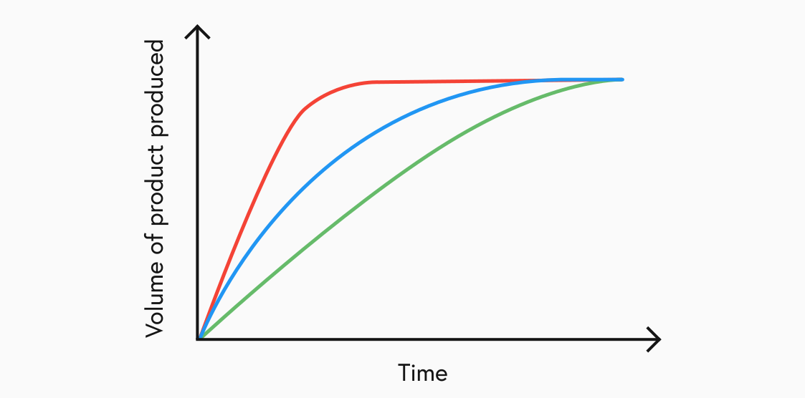
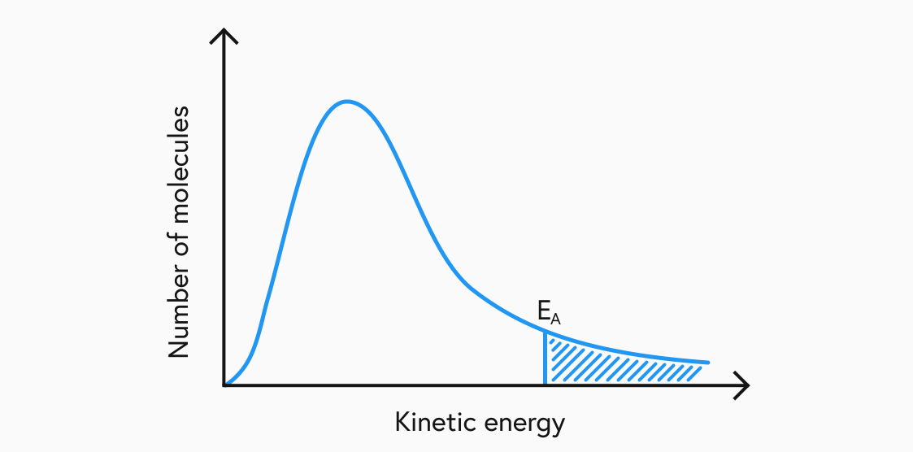
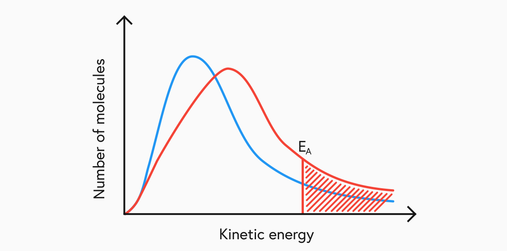
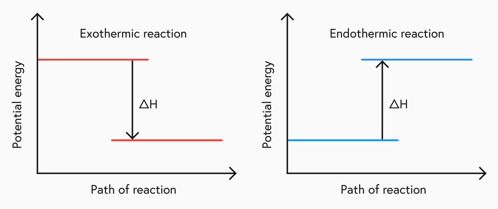
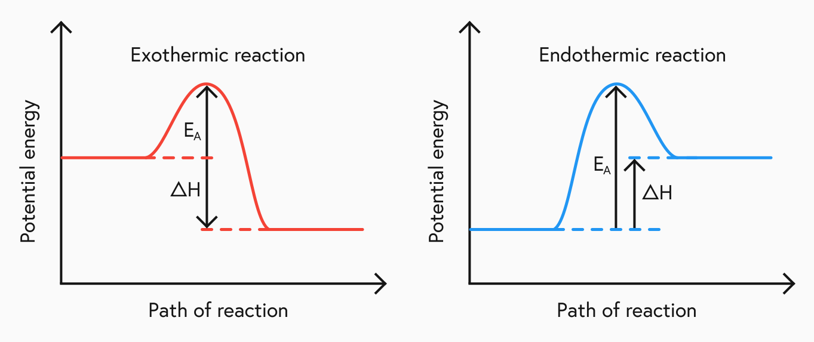

## Introduction

The rate of a chemical reaction is a very important concept as we start to look at more complicated reactants and compounds. Understanding the factors that affect the rate of a reaction is the first step towards being able to control it. This can be extremely useful for chemists in the real world. In a manufacturing process, a company may want to speed up the rate of a reaction in order to increase the output and therefore increase profit. In dangerous situations, a reaction may need to be slowed down to decrease risks such as an explosion.

## Factors affecting rate

There are four main factors that directly change the rate of a reaction:

- Particle Size  
  The smaller the particle size of the reactants, the faster the reaction.

- Concentraton  
  The higher the concentration of the reactants, the faster the reaction.

- Temperature  
  The higher the temperature of the reaction environment, the faster the reaction.

- Catalysts  
  Adding a catalyst to a reaction mixture can affect the rate of reaction.

## Reaction graphs

The rate of a reaction can be plotted in a graph. You need to be able to recognise which reaction curve represents the fastest or slowest reaction.

Above is the graphs of three reactions that each produce the same volume of product in total. However, as we can see by the gradient of each line, the red one will finish first, followed by the blue and then finally the green.

## Collision theory

All reactants are made up of atoms, ions and molecules. Collision Theory states that these small particles must collide in order to react with each other. This can be extrapolated to explain each of the factors affecting the rate of reaction.

The smaller the size of the particles, the more surface area is exposed for collisions. The higher the concentration of a reactant, the more particles that are in a sample to collide with each other. The higher the temperature, the more energy the particles have which causes them to move faster and more likely to collide.

## Activation energy

For a reaction to occur successfully, the colliding particles must have a minimum kinetic energy. This is known as the activation energy.

The activation energy can also be shown in a graph that can be used to determine which different factors impact how much of the reactants will reach the activation energy.

The shaded area represents the proportion of the reactants that reached the activation energy and became products. With an increase in temperature, we can see how the new reaction path produces more products while the activation energy itself doesn't change.

## Enthalpy change

During a chemical reaction, energy is transferred between the reaction mixture and the environment. When energy is given out into the environment, such as in combustion, the reaction is described as exothermic. When energy is taken in from the environment, such as reacting ethanoic acid with sodium carbonate, is described as endothermic.

This can also be displayed in a graph by showing the potential energy held by the reactants and products.

## Activation complex

So far we have only looked at reaction paths as going from reactants to products and the likelihood of a particle making a collision. The activation complex of a reaction is a peak energy barrier from which point any given particle will either collide or return to just being a reactant. This also affects the rate of the reaction. The higher the activation complex, the slower the reaction.

These graphs can also be used to display the enthalpy change of the reaction.

## Catalysts

A catalyst is a substance that can alter the rate of a reaction but is not used up itself. One practical example of a catalyst in the real world is a 'catalytic converter' which is used to reduce harmful gases leaving an internal combustion engine car exhaust.
