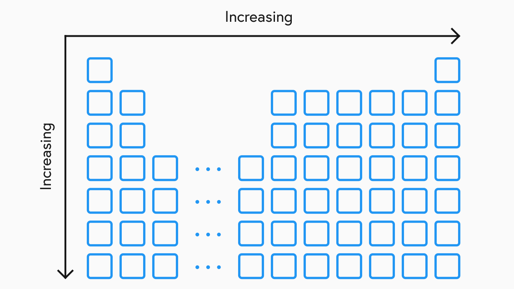
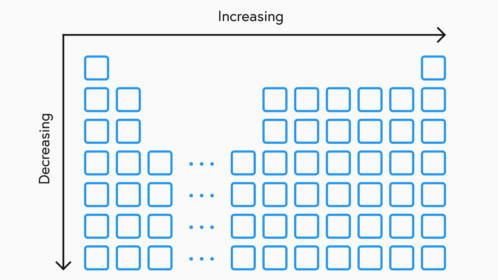

## The Periodic Table
The periodic table that we see and use today originates from centuries of early chemists attempting to turn different substances into gold, a practice known as alchemy. Through their experiments, they established key properties of elements and started finding multiple ways to group them.

In 1869, a Russian scientist named Dmitri Mendeleev came up with a new way to organise the elements. He discovered that the elements seem to fall into a repeating pattern of similar properties if arranged in order of increasing atomic mass. If this was formed into a table that stacked each repetition then the different property classes would all vertically line up. He made this clearer by labeling the vertical columns as 'groups' and the horizontal columns as 'periods'.

Chemical research was still in its early stages in the 18th century and many elements had still not been discovered. Many previous attempts at grouping elements had simply tried to cram all of the known elements at the time together as close as possible. Mendeleev realised that there were many elements that seemed to be missing from his patterns so, instead of ignoring them, he left gaps in his table and actually tried to predict the properties that might exist there.

## Covalent Radius
So far in our models of the atom, we have often thought of them as spheres. However, because electrons move extremely fast and orbit the nucleus almost as a cloud, it is almost impossible to measure the width of the atom. To try to solve this problem, scientists have devised that measuring the covalent atomic radius of an atom is a much easier guide to their atomic size. This is defined as half the distance between the nuclei of two covalently bonded atoms of the element.

<!--insert atom diagram-->

This value is going to be different for every element but there is an overall trend in the periodic table which can allow you to compare if one is going to be larger or smaller than another. We relate these trends in terms of going across a period and down a group. Covalent radius decreases going across a period and increases going down a group.

These trends occur because looking across a period, the number of protons in the nucleus increase. This causes the forces that hold the electrons in place to increase which in turn pulls the electrons in closer, reducing the covalent radius. Looking down a group, each element has progressively more electron shells which cause a 'shielding' effect that means the force from the protons is weaker on the further out electrons, increasing the covalent radius. 

These trends are not true for absolutely all elements but it does apply to most you will come across in questions. You can find all of the exact values for covalent radii on page 7 of your data book.

## Ionisation Energy
As with when you learned about ionic bonding, an ion is an element that has either gained or lost electrons, causing it to become charged. It takes a certain amount of energy to remove an electron from an atom. The ionisation energy defines the energy it takes to remove one mole of electrons from one mole of atoms in a gaseous state. There are going to be up to four different values for each element. This relates to taking a neutral atom and the energy required to consecutively remove the first, second, third and fourth outermost electrons.

Ionisation energy values vary widely between elements but there is another overall trend in the periodic table which can allow you to compare if one is going to be larger or smaller than another. It increases going across a period and decreases going down a group.

These trends exist for similar reasons as given for covalent radius. Looking across a period, the number of protons in the nucleus increase causing the forces that hold the electrons in place to increase, increasing the energy it takes to remove an electron. Looking down a group, each element has progressively more electron shells which cause a 'shielding' effect that means the force from the protons is weaker on the further out electrons, decreasing the ionisation energy. Exact ionisation energy values for each element can be found on page 11 of your data book.

## Electronegativity
When two atoms form a bond, the nucleus of each atom enacts a force on the electrons in the middle. Different elements apply different levels of force on these electrons. Electronegativity is a measure of this force.

Electronegativity values vary widely between elements but there is a third overall trend in the periodic table which can allow you to compare if one is going to be larger or smaller than another. It increases going across a period and decreases going down a group.

These patterns are consistent with ionisation energy. Looking across a period, the number of protons in the nucleus increase causing the attractive forces on nearby electrons to increase, increasing the electronegativity. Looking down a group, each element has progressively more electron shells which cause a 'shielding' effect that means the force from the protons in the nucleus is weaker on the further out electrons, decreasing the electronegativity. Exact electronegativity values for each element can be found on page 11 of your data book.
