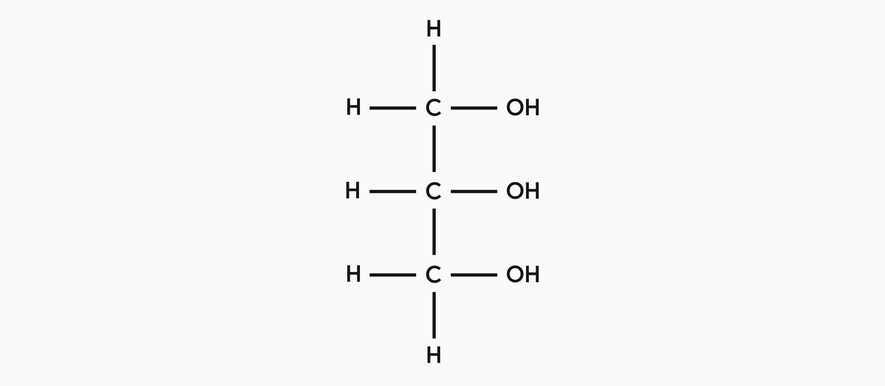
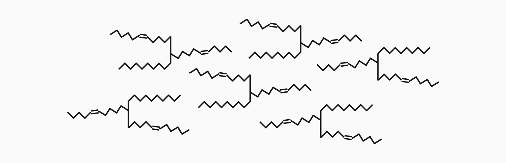

## Alcohols
An alcohol is any chemical compound with the hydroxyl functional group (OH). These types of compounds can be identified from their name when they end in '-ol'. You may remember from National 5 how to name carbon groups with different lengths of carbon chains.

<!--Insert table of alcohols (as image)-->

## Carboxylic Acids
A carboxylic acid is any chemical compound with the carboxyl functional group (COOH). These types of compounds should be easy to identify as their name ends in '-anoic acid'. Some common examples are shown in the table below with the same naming convention you have seen before.

<!--Insert table of Carboxylic Acids (as image)-->

## Esters
Esters are created by reacting alcohols and carboxylic acids together and will make far more sense if you have read and understand the sections above. These compounds have a functional group called the 'ester link' which, as the name suggests, is where the two compounds join. In order to free up those bonds from the saturated reactants, water is also created in the reaction from a hydroxyl group and a hydrogen.

Naming esters is slightly more complicated as there are two parts to consider. The general form is the first term ending in '-yl' and the second term ending in '-oate', with the alcohol carbon chain affecting the first prefix and the carboxylic acid carbon chain affecting the second.

<!--Insert table of esters-->

## Glycerol
Before we look at the chemical structures of fats and oils, it is helpful to understand a substance that forms the foundation for how they are built. Glycerol is what is known as a 'triol', an alcohol with three hydroxyl functional groups. Its chemical formual is propan-1,2,3-triol and its structure is shown below.

You should memorise this structural formula as it comes up a lot throughout the higher course.

## Fats
You may know fats from their important place as part of a human diet and many of the terms you may have heard relating to them will likely make more sense once you understand their chemical structure. Fats are a subset of esters, meaning they contain the ester link. What makes fats unique is that they actually contain three ester links that are formed when carboxylic acids bond with the three hydroxyl groups of glycerol. The formation of fats is a condensation reaction, so water is also a byproduct.

Once formed, fat molecules are fully saturated meaning all atoms in the molecules are joined by single bonds. This gives them a fork-like shape that allows them to pack together very closely and is what makes fats solid at room temperature.

## Oils
Oils are very similar to fats but with one key difference; they are unsaturated. Having double, or even triple, bonds in the carbon chains makes the molecules lose their perfect fork shape and doesn't let them pack together as closely. This is why oils are liquid at room temperature.

