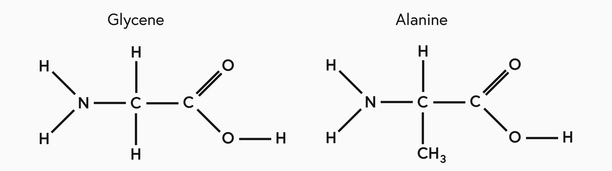

## Introduction
Proteins are some of the most fundamental building blocks for living organisms. Many foods such as milk and eggs are made of protein; even our hair, skin and muscles are all made out of different proteins. In this course we will look at their chemical structure as well as some of their properties and the processes they are involved in.

## Amino Acids
An amino acid is a simple organic compound which consists of a carbon chain with a carboxyl group (COOH) on one end and an amino group (NH2) on the other.

The human body requires many differnt amino acids in order to fuction properly. Some of these molecules it is able to produce itself, but there are some that we need to intake through our diet. These extra amino acids that our bodies cannot make are called essential amino acids.

Two of the simplist examples of amino acids are shown below.

## Polymerisation
Proteins are created by joining together amino acids by connecting each amino group to the carboxyl group on another molecule. This forms a polymer through a condensation reaction, a process known as condensation polymerisation.

$$Amino \text{ } Acid + Amino \text{ } Acid \rightarrow Protein \text{ } Polymer + Water$$

Where the amino acids are connected is reffered to as a peptide link, but you may also hear it desicribed as an amide link.

## Breaking Proteins
Just as proteins can be created by condensation reactions, they can also be broken down into individual amino acids by hydrolysis. This adds back in water to separate the peptide links. You need to be able to spot where peptide links occour in a long polymer chian and indentiy the amino acids that would be left.
