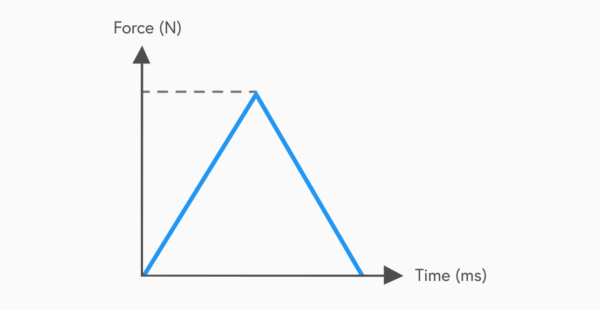

## Momentum
The momentum of an object is the product of its mass and velocity. It is a vector quantity so direction must be considered in momentum calculations. It is given the symbol 'p' and its units are kg ms-1.

$$p = mv$$

For collisions and explosions along a straight line, there is a law of Conservation of Momentum:

> *"In the absence of external forces, the total momentum just before an event is the same as the total momentum just after the event."*

Applying this law of conservation of momentum allows us to analyse collisions and explosions to solve problems. <!--We can also look at the energy involved to determine whether the collision or explosion was elastic or inelastic.-->

## Collisions
In this course, we look at collisions between two objects travelling along a straight line. Either one of the objects could be stationary or they could both be moving. There are two main types of collisions.

During elastic collisions:
- Kinetic energy is conserved
- Momentum is conserved
- The 2 colliding objects bounce apart

During inelastic collisions:
- Kinetic energy decreases
- Momentum is conserved
- The 2 colliding objects will likely stick together

## Explosions
In an explosion, there is only one stationary object at the start. This object splits up into two parts which travel in opposite directions in a straight line.

- Momentum is conserved
- Kinetic energy increases

The motion of objects after an explosion can also be explained by Newton's third law:

> *"For every action, there is an equal and opposite reaction."*

## Impulse
When a force acts on an object, the force is said to give the object an impulse. The impulse is equal to the average force multiplied by the time over which the force acts. It is a vector quantity so direction must be considered. Its units are Ns or kgms-1.

$$Impulse = Ft$$

It is also equivelant to the change in momentum:

$$Ft = mv - mu$$

## Force-time Graphs
How the force changes through an impact can be displayed by means of a force-time graph.

The area under the graph represents:
- The impulse of the force exerted by the wall on the ball during its time of contact.
- The change in momentum experienced by the ball during its time of contact with the wall.

## Impact safety
There are many safety features which are all designed to reduce the maximum force exerted during an impact. Airbags, crumple zones in cars, crash helmets, boxing gloves and head guards are all made to increase the contact time. If we know that the impulse is equivalent to the change in momentum during an impact and we assume that the change in momentum is constant, then an increase in the time will decrease the force.
