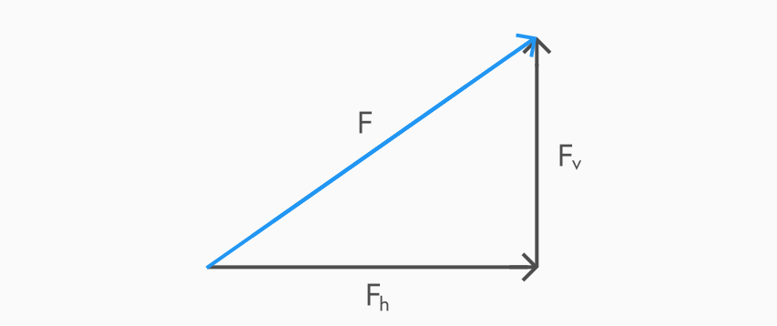
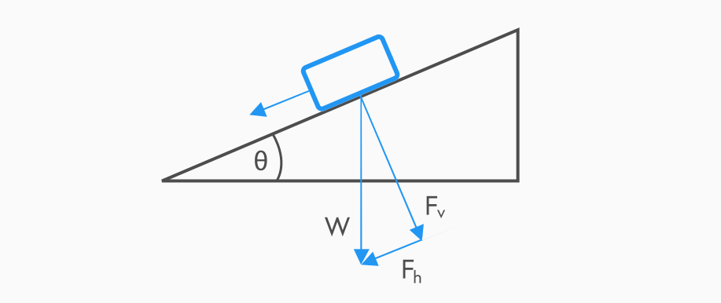

## Dynamics revision

When studying dynamics, we look at balanced and unbalanced forces. These are described in Newton’s first two laws:

- Newton’s first law  
  _“If the forces acting on an object are balanced, the object will continue to travel with constant speed in a straight line”_

- Newton’s second law  
  _“If the forces acting on an object are unbalanced, the object will experience an acceleration.”_

This second law is connected to the equation which defines unbalanced forces acting on objects:

$$F = ma$$

You should also be familiar with the equation to calculate the force of the weight of an object:

$$W = mg$$

Force is measured in Newtons ($N$), where one Newton is defined as the value of the unbalanced force which will accelerate a mass of 1kg at 1ms-2.

## Terminal velocity

Previously, we have discounted friction from our calculations or assumed that it remains constant regardless of velocity. In actual fact, friction such as air resistance increases as velocity increases.

In the scenario of a skydiver jumping out of a plane, if air resistance was negligible, we would expect for them to continue to accelerate indefinitely as gravity pulls them down. We can even calculate this uniform acceleration using Newton’s second law. However, in practice, the skydiver would accelerate at first due to the downward unbalanced force, but as they increased velocity the upward force of the air resistance would also increase. This would continue until the downward force of gravity was equal to the upward force of friction, causing the skydiver to travel at a constant ‘terminal velocity’ in a straight line.

## Tension

If a force is being applied to pull an object that is on the end of a rope, then there is a tension in the rope which is equal to the force acting on the object in that direction. This can be used to calculate the unbalanced force if the force of friction in the opposite direction is also known:

$$F = Tension - Friction$$

Sometimes the force of friction is negligible which means that the acceleration of an object can be calculated using the tension as the unbalanced force in Newton's second law.

## Connected systems

To make problems involving forces acting on masses more complicated, we start to look at them as part of a system. This could be anything from a pulley to train carriages. Questions in this section often have multiple parts where you will be asked about forces on individual objects as well as the system as a whole.

In the example of a train, the locomotive at the front will be applying a force on the other carriages behind it. This will cause tension at each connection but the different tension values will each be different. If a train has three passenger carriages, the locomotive must supply enough force to pull all three of the carriages. However the first carriage will only need to supply the force to pull two, and the one behind that only enough to pull one.

Remember, if the question asks about the whole system then you must use the total mass of all the parts involved as your mass value in the force equation.

## Resolving forces

Any single vector can be replaced by two other vectors at right-angles to each other. These two vectors are called the components of the original vector. The effect of both of these component vectors acting on the object simultaniously would be exactly the same as that of the original vector. This process is called resolving a vector.

The magnitude of each of the component vectors can be calculated by using trigonometry.

$$F_V = F sin θ$$

$$F_H = F cos θ$$

## Slopes

When an object is placed on a slope, the weight of the object acts directly downwards towards the centre of the earth. The weight of the object can be resolved into right-angle components acting parallel to the slope and perpendicular to the slope. The component of the weight parallel to the slope is used in problems involving the
motion of the object up or down the slope.

<!--Insert diagram-->

## Conservation of energy

The Law of Conservation of Energy states:

> _"Energy cannot be created or destroyed, it can only be changed from one form to another."_

This means all energy must be accounted for when it changes states. Energy can take many forms but when talking about forces we tend to look specifically at kinetic and potential energy. These can be calculated using the following equations:

$$E_k = \dfrac{1}{2} mv^2$$

$$E_p = mgh$$

Another important concept is work, the energy expended to apply a force to an object to make it move a distance:

$$E_w = Fd$$
