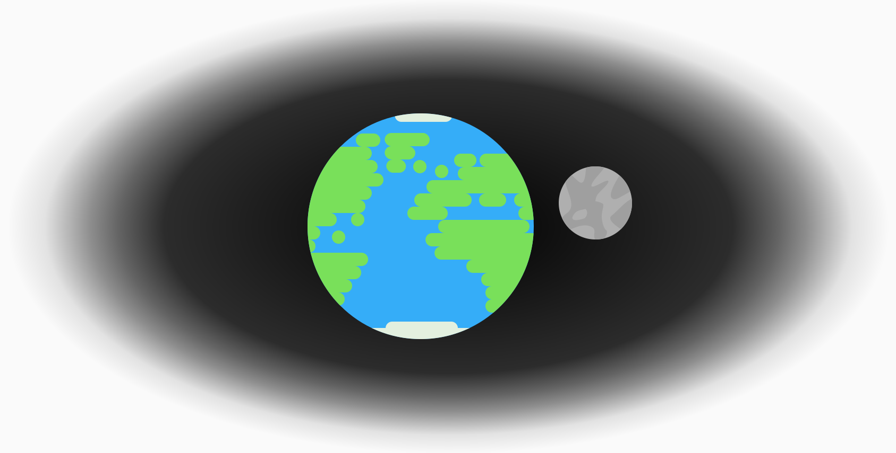

## Newton's cannon

As well as giving us the three laws, Isaac Newton also came up with an ingenious thought experiment for satellite motion that pre-dated the first artificial satellite by almost 300 years. Essentially, Newton suggested that if a cannon fired a cannonball it would fall towards the Earth. However, if it was fired at ever higher speeds then at some speed it would fall towards the Earth but never actually land since the curvature of the Earth would be the same as the flight path of the cannonball. This would then become a satellite. The object remains in orbit because it is being pulled to the Earth by gravity. If gravity was suddenly switched off, the object would continue in a straight line.

## The Solar System

Gravity is responsible for the formation of our solar system. At some point, generally believed to be between 4 and 5 billion years ago, a huge cloud of gas collapsed together due to its own gravitational attraction. Most of this gas collapsed into the gravitational centre, forming the Sun. However, small amounts of mass formed a disk that circled the newly formed star. The gravitational attraction between the particles that made up this disk then resulted in the formation of the planets we can observe today. This process is known as the aggregation of matter.

As we know, the Earth follows a curved path around the Sun. This means that, according to the first law of motion, there must be an unbalanced force acting on the Earth. This force is provided by the gravitational pull of the Sun. The same is true for the orbit of the Moon, the Earth’s gravity is exerting an unbalanced force.

## Gravitational field strength

Gravitational fields are areas where masses experience a force. We call this gravitational force weight, with the symbol 'W'. The weight can be calculated by the product of the mass of the object with the gravitational field strength:

$$W = mg$$

Gravitational field strength is a vector quantity with the same direction as the weight and has the unit Nkg-1. The value for Earth is -9.8Nkg-1 and other location values can be found in a data book or the front inside page of an exam paper.

If a mass is allowed to fall freely, ignoring air resistance, the unbalanced force is equal to its weight, causing it to accelerate downward with a constant acceleration.

## Law of Gravitation

Newton's law of universal gravitation proposed that every body with mass will exert a force on every other body with mass. The theory states that the force of gravitational attraction is dependant on the masses of both objects and is inversely proportional to the square of the distance that separates them.

$$F = \dfrac{Gm_1m_2}{r^2}$$

Where:

- $F =$ the force ($N$)
- $m_1 =$ the first mass ($kg$)
- $m_2 =$ the second mass ($kg$)
- $r =$ the distance between them ($m$)
- $G =$ the gravitational constant ($Nm^2kg^{-2}$)

The value G, the gravitational constant, is one of the most difficult constants to measure accurately. The value we use in Higher Physics is:

$$G = 6.67 \times 10^{-11} Nm^2kg^{-2}$$

<!-- G = 6.67 x 10-11 Nm2kg-2 -->
