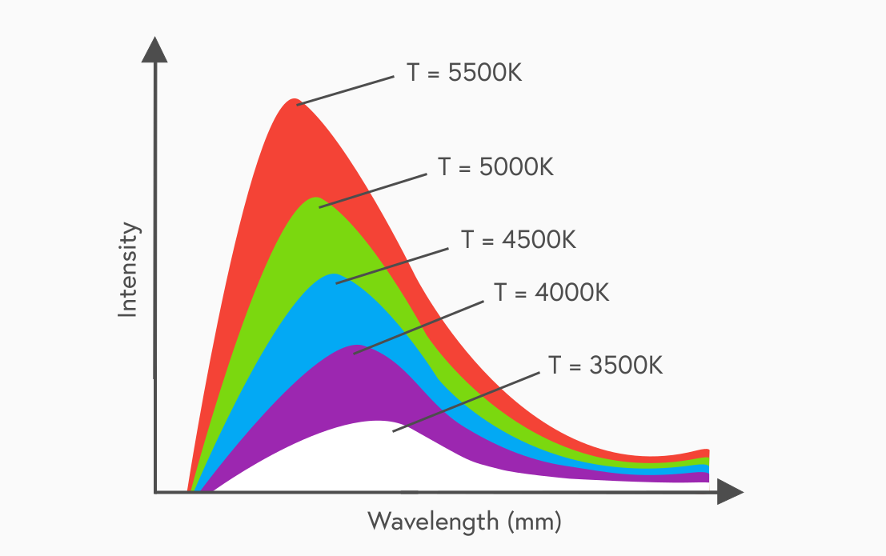

## The Doppler effect
The Doppler Effect is the change in frequency observed when a source of sound waves is moving relative to an observer. This is often most easy to explain when thinking about sound waves. In general, more sound wavefronts are received per second when the source of sound waves is moving towards the observer, so the frequency heard by the observer is increased. Similarly, fewer sound wavefronts are received per second when the source of sound waves is moving away from the observer and so the frequency heard by the observer is decreased. The actual frequency heard by an observer is calculated by:

$$f_0 = f_s \Big(\dfrac{v}{v \pm v_s}\Big)$$

Where:
- f0 = the frequency heard by the observer (Hz)
- fs = the frequency of the source (Hz)
- v = the velocity of sound waves (ms-1)
- vs = the velocity of the source (ms-1)

If the source is coming towards the observer, the frequency increases, so the sign on the bottom of the equation should be negative. If the source is moving away from the observer, the frequency decreases, so the sign on the bottom of the equation should be positive.

## Redshift
Information about a star’s temperature, composition and motion can be found by analysing its spectrum. In the late 19th and early 20th centuries, astronomers examined the spectra of light from distant stars and observed that they showed similar characteristics to the Doppler effect for sound. The light appeared to be shifted towards the red end of the spectrum, meaning the wavelength appeared to increase. This suggested that the light was coming from a source which was moving away from the earth.

The physical quantity called red shift ‘z’ is given by the equation:

$$z = \dfrac{\lambda_{observed} - \lambda_{rest}}{\lambda_{rest}}$$

## Hubble's Law
In the 1920s, the astronomer Edwin Hubble noticed that the light from some distant galaxies was redshifted. For each element, the spectral lines were all shifted by the same amount for each galaxy. Over a few years, he examined the redshift of galaxies at varying distances from Earth. He observed that the further away a galaxy was, the faster it appeared to be travelling. The speed of objects travelling away from Earth is known as ‘recession velocity’.

This relationship between distance and recession velocity of a galaxy is known as Hubble’s Law:

$$v = H_0d$$

Where:
- v = recession velocity of star (ms-1)
- d	= distance to the star (m)
- H0 = Hubble's constant (s-1)

Hubble's constant is given as 2.34x10-18s-1.

## Age of the Universe
It may sound obvious but if galaxies are travelling away from us then they must have been closer in the past. By working back in time, it is possible to calculate a time where all the galaxies were at the same point in space. This allows for the age of the universe to be calculated. According to NASA, the universe is approximately 13.7 billion years old.

## Dark Matter
In the same way that Earth orbits the Sun, the Sun orbits around our galaxy with a period of approximately 240 million years. The speed of rotation of an object is determined by the size of the force maintaining its rotation. For the sun, this central force is due to gravity, which is determined by the amount of matter inside the Sun’s orbital path. If we know the rotational speed of the Sun we can calculate how much force is required to keep it in orbit, and hence the amount of matter in our galaxy.

There is only one problem. Calculations of the amount of matter in the galaxy suggest there is more than astronomers can detect. The conclusion appears to be a new type of matter called ‘dark matter’ must exist in the universe. This matter does not interact with electromagnetic radiation and so is completely invisible. Current estimates are that as much as 22% of the total matter in the universe could be made up of dark matter.

## Dark Energy
Both matter and dark matter contribute to gravity. Gravity is an attractive force so all the matter in the universe is acting to slow the rate of outward expansion. However, measurements of the expansion rate of the Universe lead to the conclusion that the rate of expansion is actually increasing rather than decreasing. Something is overcoming the force of gravity to cause the universe to expand at an ever-increasing rate. This 'dark energy', similar to dark matter, is not detectable in the same way we detect electromagnetic energy radiation. Current estimates are that up to 74% of the total energy in the universe could be in this form.

## Stellar temperatures
The Big Bang theory states that the universe started with a sudden appearance of energy at a singular point. This started gathering and became matter, which then expanded and cooled rapidly. The theory therefore predicts that the universe should now, 13.7 billion years later, have a very cool temperature. If we can measure this temperature we can see if it accords with the theory.

Stars emit radiation over a wide range of wavelengths. Different intensities of radiation are produced from stars of different temperatures which is related to the wavelength of light emitted. This can be graphed as a series of thermal emission peaks. Any hot object emitting electromagnetic radiation is referred to as a ‘blackbody radiator’.

Thermal emission peaks allow the temperature of stellar objects to be determined. Three details emerge from studying these peaks:
- Stellar objects emit radiation over the complete electromagnetic spectrum.
- Each stellar object has a peak wavelength that depends on its temperature.
- As the temperature of the star increases, there is more energy at each wavelength and the peak wavelength shifts to shorter wavelengths.

## The Big Bang
Hubble’s Law was the first suggestion that a cosmic starting point could be identified. If the universe is currently expanding then at some earlier time it must have been compressed into a single fixed point where all the matter and energy in the universe was compressed into an infinitesimally small volume.

On top of this, there is other evidence for the Big Bang Theory:

- Cosmic microwave background radiation (CMBR)  
  If the universe started as predicted in the theory, then about 400,000 years after the big bang the universe will have expanded and cooled sufficiently for photons to start to travel across space without being absorbed or scattered. This radiation became the CMBR which we can still detect today, uniformly distributed across the universe.

- Temperature of the universe  
  By analysing the thermal emission peak of the CMBR, the temperature of the universe can be measured. This value fits very well with the average temperature predicted by the Big Bang Theory of 2.73K.
