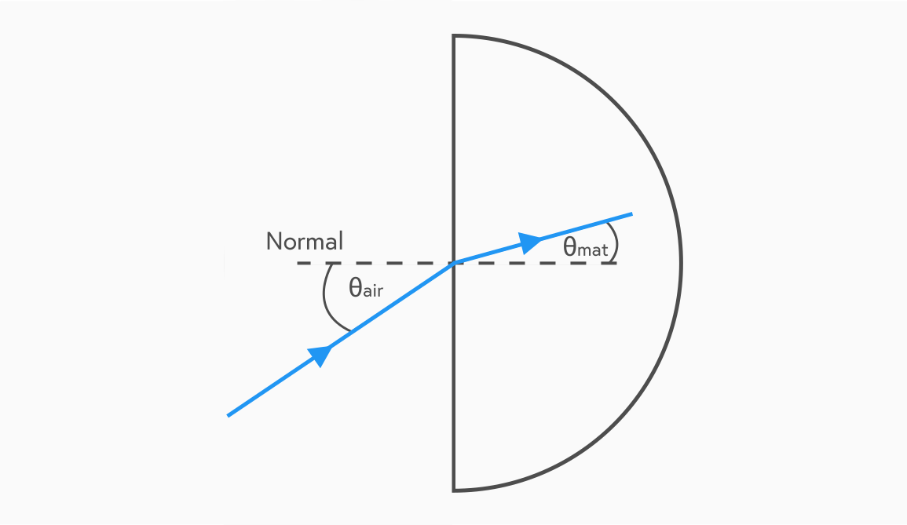
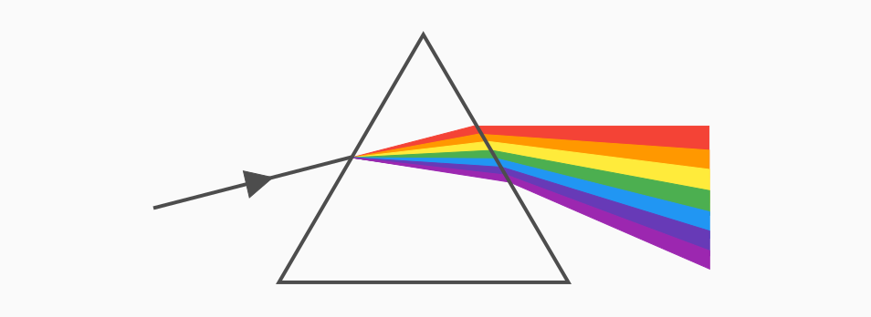

## Refractive index
When light travels from one medium to another, it will have a change in velocity. For example, if a ray of light is shone from air into a semi-circular block of transparent material which is denser than air, at any angle other than 90˚, the ray changes direction on entering the material.

We can measure the angle at which the light is travelling relative to the material by drawing a dotted line at 90˚ to the edge called the normal. By comparing the ratio of the angles in various materials, scientists noticed there was a correlation of the sine of each angle shown in the following equation:

$$\dfrac{sinθ_1}{sinθ_2} = n$$

Where material 1 is a vacuum and material 2 is the second material. This gives the absolute refractive index of the second material.

> *"The absolute refractive index of a material is the ratio of the sine of the angle of incidence in a vacuum to the sine of the angle of refraction in the material."*

This equation is often shown in its general form for refractive index calculations:

$$n_1 sinθ_1 = n_2 sinθ_2$$

For these calculations, the refractive index of a vacuum and air are considered the same, both equal to 1. The greater the refractive index, the greater the amount of refraction. The refractive index of a material is also the same regardless of if the light is moving from a more dense material to a less dense one or vice versa.

## Velocity and wavelength
When refraction occurs:
- Velocity increases or decreases		
- Wavelength increases or decreases		
- Frequency remains constant

> *"The refractive index can also be found from the ratio of the speed of light in a vacuum to the speed in the material and the ratio of the wavelengths."*

Following this knowledge, we can expand our earlier equation:

$$n = \dfrac{sinθ_1}{sinθ_2} = \dfrac{v_1}{v_2} = \dfrac{\lambda_1}{\lambda_2}$$

This version can also be rearranged into its general forms for both velocicty and wavelength:

$$n_1 v_1 = n_2 v_2$$

$$n_1 \lambda_1 = n_2 \lambda_2$$

## Frequency
The refractive index of a material depends on the frequency of the light hitting it. This can be seen when white light passes through a glass prism. A visible spectrum is produced because each of the component colours of white light has a different frequency, so is each refracted at a different angle.

## Total internal refraction
Total internal reflection is a phenomenon that can occur when light travelling in a dense medium meets a boundary with a less dense medium.

When a monochromatic light ray is incident at the glass-air boundary at an angle close to the normal line, most of the light ray is refracted into the air. A small amount of the light is reflected back into the glass.

If the angle of incidence between the incoming light ray and the normal line is increased, there is a point where the refracted ray is at 90˚ to the normal line. We call the angle of incidence at which this happens the critical angle for the material.

If the angle of incidence between the incoming light ray and the normal line is increased above the critical angle, all of the light ray is reflected back into the glass by the flat surface. This is called Total Internal Reflection.

The relationship between the critical angle for a material and its refractive index is shown below:

$$sinθ = \dfrac{1}{n}$$

Total internal reflection has many practical applications including optical fibres which have lead to breakthroughs in internet speed.
