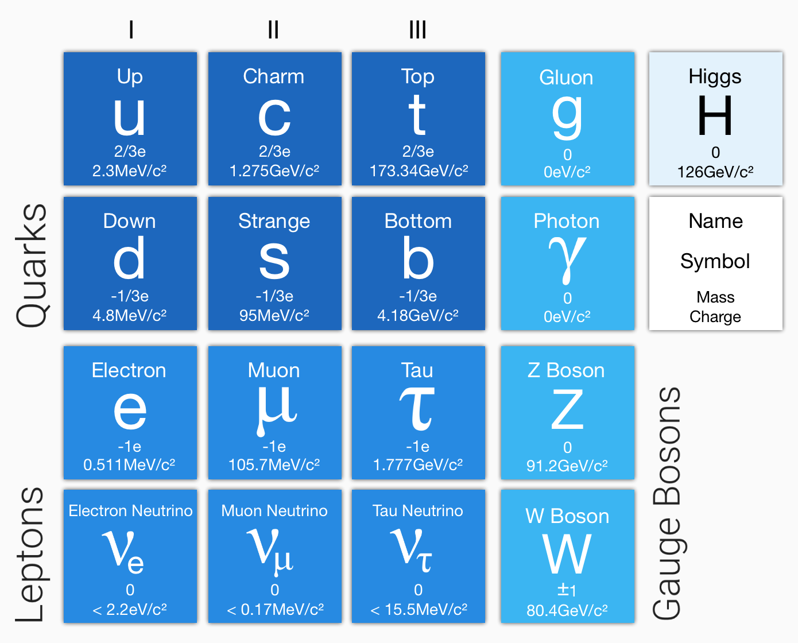

## Orders of magnitude
In physics, we try to measure everything from the largest galaxies all the way down to the smallest particles that make up everything. The width of the observable universe is about 1026m and the approximate diameter of a proton is 10-15m. In order to simplify this, we talk about magnitude in terms of order of magnitude. This is each power of 10 in scientific notation. For example, one order of magnitude is a difference of x10, two orders of magnitude is a difference of x102.

## Particle accelerators
In particle accelerators, such as the Large Hadron Collider in Switzerland, very small particles such as protons and electrons can be passed through electric and magnetic fields which causes them to travel at very high speeds. When these particles collide, it releases a huge amount of energy, some of which may be converted into mass which produces showers of nuclear particles. Massive detectors that pass these tiny particles through a magnetic field can measure their deflection to obtain their mass and charge. It is experiments like these that have given insights that give rise to the standard model of fundamental particles and their interactions that we use today.

## The model

## Fundamental particles
Particles that cannot be divided into smaller ones are referred to as Fundamental particles. In the standard model of particle physics, there are 12 fundamental particles labelled as fermions. Out of these 12, there are 6 types of quarks and 6 types of leptons. These are split into 3 generations that increase in mass, and hence energy, from the 1st generation to the 3rd.

## Fundamental forces
Particles can experience 4 types of forces:
- Strong (nuclear) force
- Weak (nuclear) force
- Gravitational force
- Electromagnetic force
 
The gravitational force is relatively very weak and can be ignored in terms of subatomic particles. It is also not as connected to the other 3 forces and so is not included in the standard model.
 
The main subatomic forces are explained using 'force carriers' or 'force mediating particles' called Guage-bosons.

## Antiparticles
Most matter particles, such as protons, electrons and neutrons as well as all of the fundamental particles have corresponding antiparticles. These antiparticles have the same mass but the opposite charge. Antiparticles are denoted as having the same symbol as the particle but with a bar over it, with the exception of a positron (e+), the antiparticle of an electron. When particles and antiparticles meet, they will annihilate each other and their combined mass will be converted into energy. However, the universe contains far more particles than antiparticles, so annihilation is extremely rare.

## Hadrons
Hadrons are composite particles made from quarks and antiquarks that are held together by the strong force. These particles are bound together so strongly that quarks have never been found individually.
 
There are 2 main types of hadron:
- Baryons – made from 3 quarks or 3 antiquarks
- Mesons – made from 2 quarks and an antiquark
 
Baryons and Mesons can only have whole integer charges, such as 1, 0, -1.
 
## Beta decay
Beta decay can occur in unstable nuclei where the nucleus emits an electron, leaving the atom with the same mass number but an increase of 1 in the atomic number. For example:

$${}^{234}_{91}Pa \rightarrow {}^{234}_{92}U + {}^{0}_{-1}e$$

$$\ce{^{227}_{90}Th+}$$
 
In general terms, we can think of this as a neutron becoming a proton:

$${}^{1}_{0}n \rightarrow {}^{1}_{1}p + {}^{0}_{-1}e$$
 
While the mass number and the charge of the atom is conserved, the actual mass of the proton is less than the mass of the neutron. This decrease in mass results in a release of energy, available as kinetic energy to the emitted electron. However, particle physicists discovered that the kinetic energy of the electron was not always equal to this value. In fact, the electron could have almost any value for its kinetic energy.
 
> *“The evidence points to the presence of a second particle, which shares the kinetic energy.  This particle would have to have no charge (since charge is already conserved) and a very low mass since it is almost undetectable.  This neutral, tiny one was named the neutrino.”*
 
The particle was determined to be an electron anti neutrino, the antimatter equivalent to the electron neutrino. This allows us to complete the equation:

$${}^{234}_{91}Pa \rightarrow {}^{234}_{92}U + {}^{0}_{-1}e + \bar{v}_{e}$$
