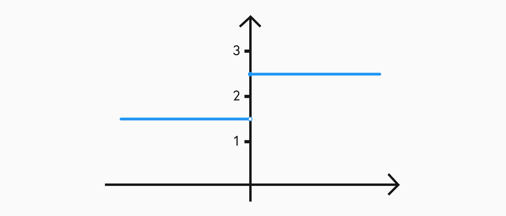

## Definition

As seen in the previous topic, we know that functions may not be defined for all $x$. If we take some $a$ and say that we know a function $f$ is defined over an interval up to but not necessarily including $a$, then we can define the limit at $a$ as:

$$L = \displaystyle\lim_{x \to a} f(x)$$

This means that as $x$ tends to $a$ we see that $f(x)$ tends to $L$.

## One-sided limits

When working with a discontinuous function, there may be points where the limit as $x$ approaches $a$ from one side is different than from the other side. There are three main possibilities when looking at limits:

- Only the left limit is defined  
  Suppose that a limit at a point exists only when $x$ approaches $a$ from the lower side. We represtent this as the limit when $x$ is sufficiently close to but less than $a$:

  $$\displaystyle\lim_{x \to a^-} f(x)$$

   

- Only the right limit is defined  
  Suppose that a limit at a point exists only when $x$ approaches $a$ from the higher side. We represtent this as the limit when $x$ is sufficiently close to but greater than $a$:

  $$\displaystyle\lim_{x \to a^+} f(x)$$

   

- Both the left and right limits are defined  
  Suppose that a limit at a point exists when $x$ approaches $a$ from both sides. However, becuase the function is discontinuous the two limits return differnt values. For example, in this case the left and right limits will be given by:

$$\displaystyle\lim_{x \to 0^-} f(x) = \dfrac{3}{2} \qquad \displaystyle\lim_{x \to 0^+} f(x) = \dfrac{5}{2}$$

<!-- More on this -->

## Limit laws

When calculating limits there are 8 rules that can make them much easier to deal with.

1. $\displaystyle\lim_{x \to a} [f(x) + g(x)] = \displaystyle\lim_{x \to a} f(x) + \displaystyle\lim_{x \to a} g(x)$

2. $\displaystyle\lim_{x \to a} [f(x) - g(x)] = \displaystyle\lim_{x \to a} f(x) - \displaystyle\lim_{x \to a} g(x)$

3. $\displaystyle\lim_{x \to a} [cf(x)] = c \displaystyle\lim_{x \to a} f(x)$

4. $\displaystyle\lim_{x \to a} [f(x) g(x)] = \displaystyle\lim_{x \to a} f(x) \times \displaystyle\lim_{x \to a} g(x)$

5. $\displaystyle\lim_{x \to a} \frac{f(x)}{g(x)} = \dfrac{\displaystyle\lim_{x \to a} f(x)}{\displaystyle\lim_{x \to a} g(x)} \qquad \text{ if } \displaystyle\lim_{x \to a} g(x) = \not 0$

6. $\displaystyle\lim_{x \to a} [f(x)]^n = \Big[\displaystyle\lim_{x \to a} f(x) \Big]^n$

7. $\displaystyle\lim_{x \to a} c = c$

8. $\displaystyle\lim_{x \to a} x = a$

## Calculating limits

3 techniques

- Direct subsitution
- Common factors
- something

## L'hopitals rule

## The squeeze theorem
