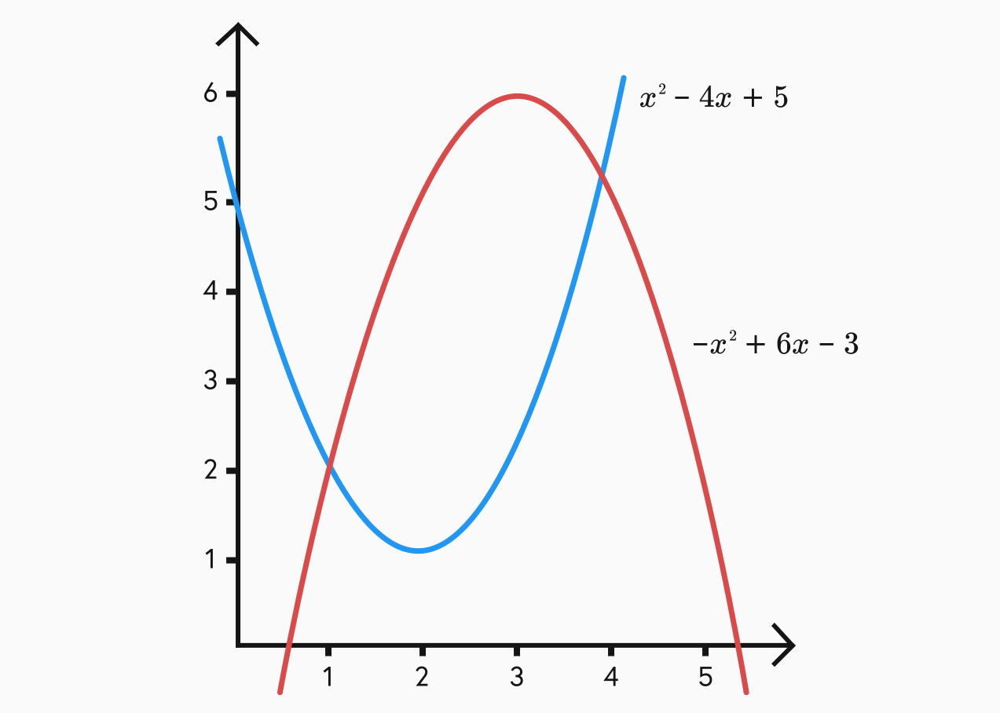

## Area between curves

While integrating a function can give us the area under its graph, we also have to think about cases where we have more complex shapes that cannot be drawn with just one function. This is where the area between multiple curves comes in.

In its simplest form, the area between two curves in the positive plane is given by the area of the higher one minus the area of the lower one.

These two functions cross at (1,2) and (4,5). This is important to take into account to ensure you are only calculating area within the bounds you are looking at.

$$\text{Area of X} = \displaystyle\int_{1}^{4} -x^2 + 6x - 3 \text{ } dx - \displaystyle\int_{1}^{4} x^2 - 4x + 5 \text{ } dx$$

## Volume

## Arc length

## Differential equations?
